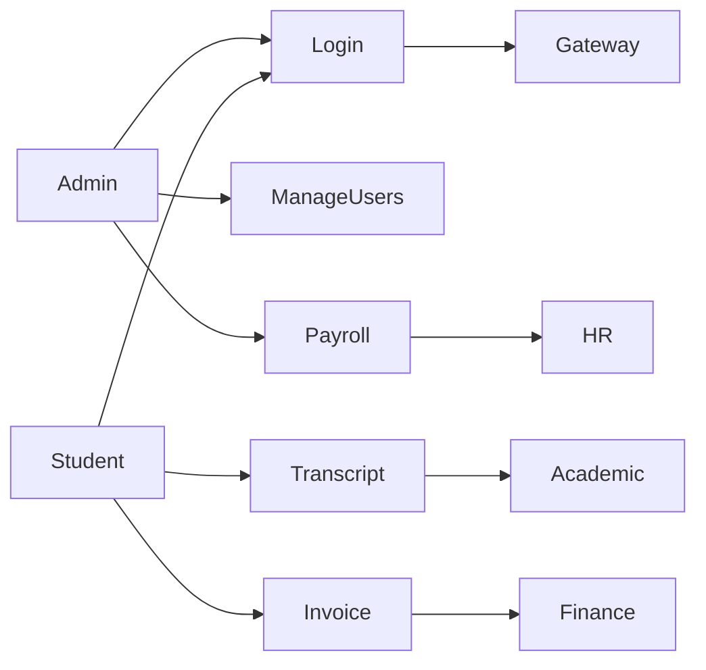
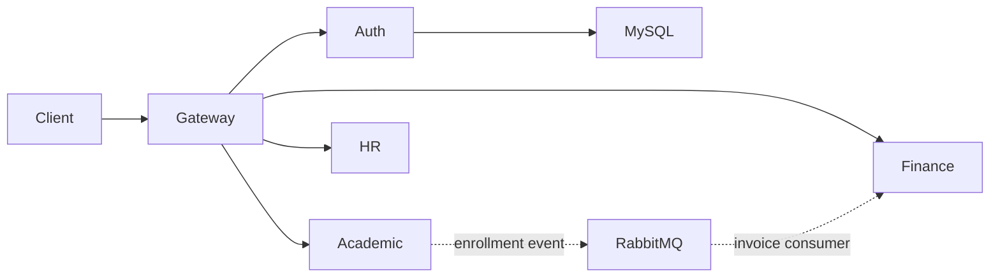
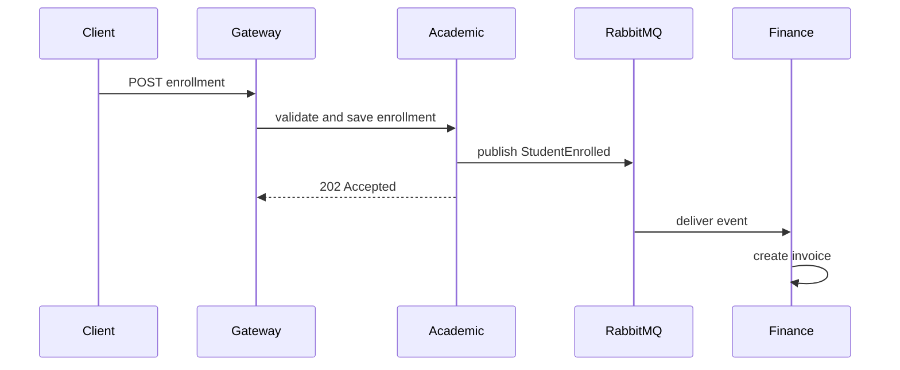

# UML and Architecture Notes

## Use case

## Deployment

## Enrollment sequence

## Class model

The service request models are the code-level classes: `RegisterRequest`, `LoginRequest`, `Grade`, `TranscriptRequest`, `InvoiceRequest`, and `PayrollRequest`. Each service owns its model and persistence boundary.
