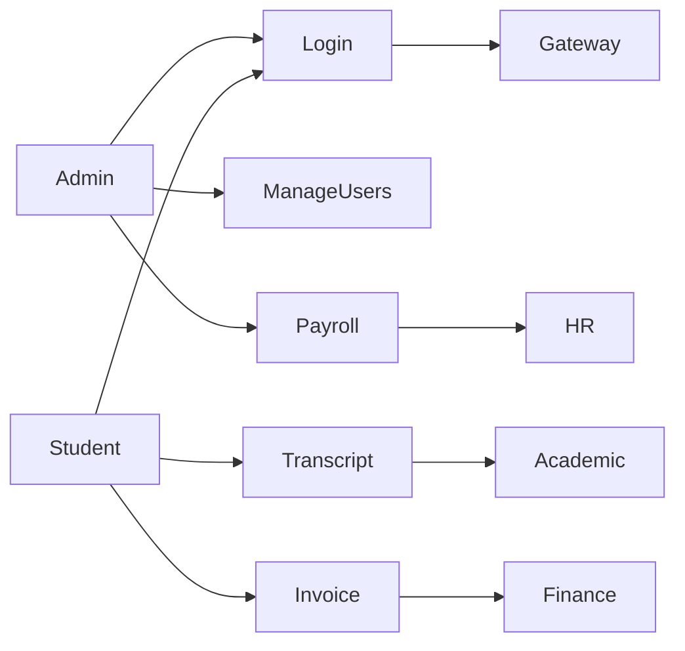
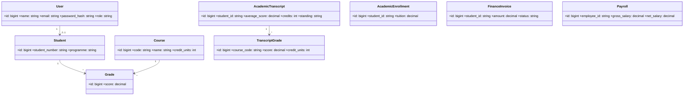
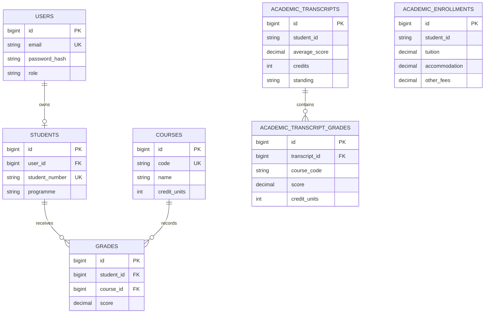
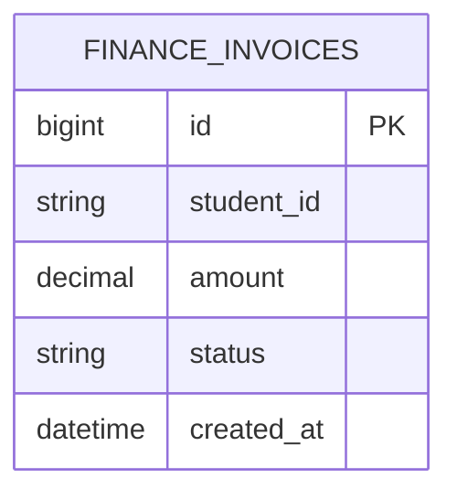
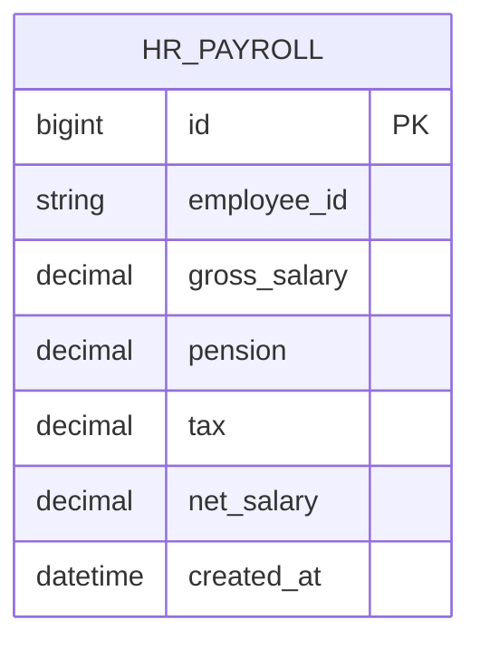
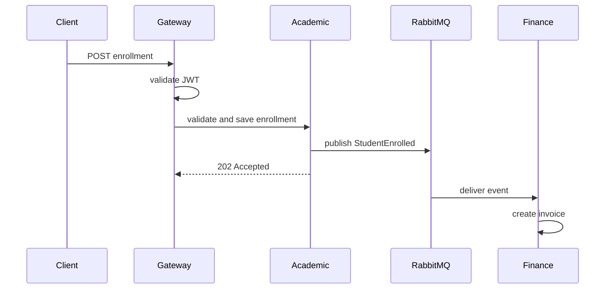

# UML and Architecture Notes

## Use-Case Diagram



## Class Diagram



## ERD - Academic Module



## ERD - Finance Module



## ERD - HR Module



## Deployment Diagram

```mermaid
flowchart LR
  Client --> Gateway
  Gateway --> Auth
  Gateway --> Academic: JWT validated
  Gateway --> Finance: JWT validated
  Gateway --> HR: JWT validated
  Auth --> MySQL
  Academic -. enrollment event .-> RabbitMQ
  RabbitMQ -. invoice consumer .-> Finance
```

## Enrollment Sequence Diagram



The request model classes `RegisterRequest`, `LoginRequest`, `Grade`, `TranscriptRequest`, `InvoiceRequest`, and `PayrollRequest` validate each API request before persistence or processing.
